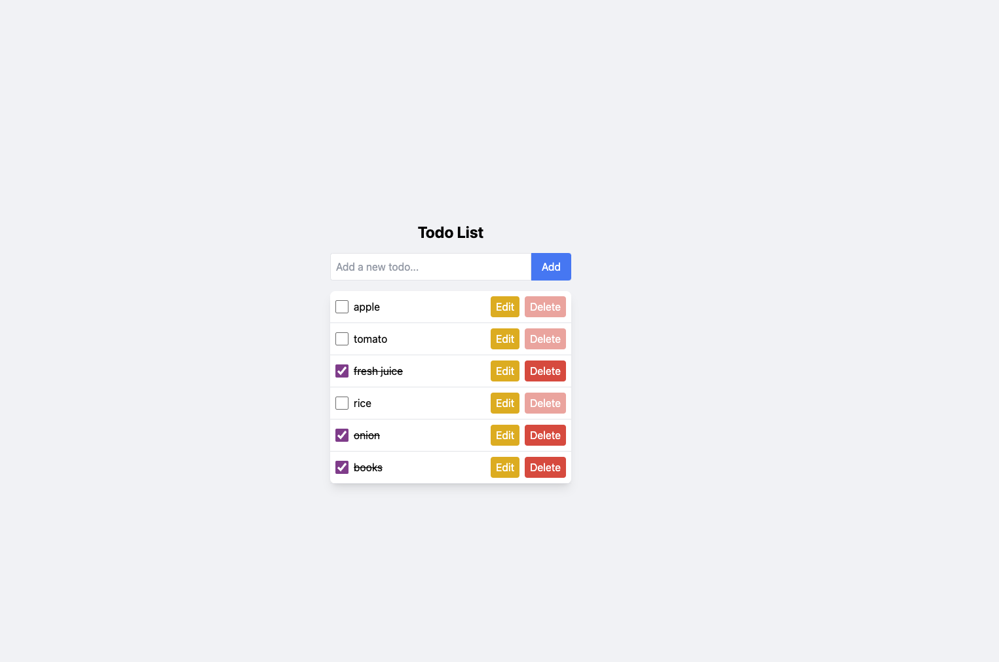

# Todo List Application

## Overview

This is a simple and functional Todo List application built with React. The application allows users to add, edit, delete, and toggle the completion status of tasks. It is designed to be user-friendly with a clean and responsive interface. State management is handled using the `useReducer` hook, ensuring that state updates are straightforward and maintainable. For styling, TailwindCSS is utilized to create a modern and responsive design with minimal effort.

## Screenshot



## Features

- **Add New Todos**: Users can easily add new tasks to their todo list.
- **Edit Existing Todos**: Existing tasks can be edited to update their descriptions.
- **Delete Todos**: Completed tasks can be removed from the list.
- **Toggle Completion Status**: Users can mark tasks as complete or incomplete by using a checkbox.
- **Responsive Design**: The application is responsive and adapts well to different screen sizes.

## Tech Stack

- **React**: A JavaScript library for building user interfaces.
- **useReducer**: A hook for managing state in complex components.
- **TailwindCSS**: A utility-first CSS framework used for styling the application.

## Installation

To run this project locally, follow these steps:

1. **Clone the repository**:
   ```
   git clone https://github.com/zahrajoulaei/todoapp-with-UseReducer-React
   cd usereducer
    ```
 2. **Install the dependencies**:
    ```
    npm install
    ```
 3. **Run the development server:**:
    ```
    npm run dev
    ```


4.	**Open your browser and navigate to http://localhost:5173 to see the application in action.**


## Styling with TailwindCSS

TailwindCSS is used to style this application, providing a utility-first approach to creating responsive and modern user interfaces. TailwindCSS allows for rapid development with a focus on flexibility and consistency. The use of utility classes directly in the markup enables quick iterations and modifications without leaving the HTML.

